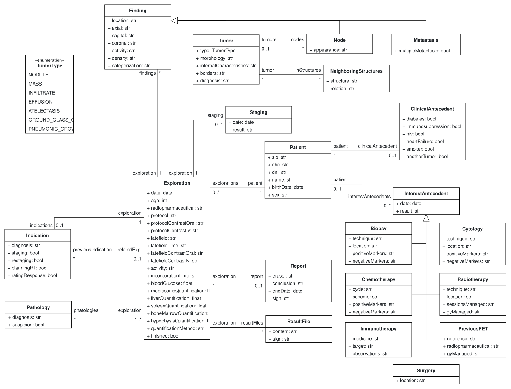

# Nuclear Medicine for Lung Cancer

This repository contains a class diagram built with [BESSER](https://editor.besser-pearl.org/), a low-code, open-source platform for model-driven software development.

The model was inspired by the use case described in the paper *"A Conceptual Model-Based Platform for Semi-Automatic Report Generation to Streamline Medical Diagnostics of Lung Cancer and PET/CT Data Management"*. PET/CT is a nuclear medicine diagnostic test that combines functional and anatomical imaging and is widely used in oncology to detect and stage tumors. After the test, physicians must manage the resulting data and write a structured report by hand, a task that benefits from a dedicated information system. The paper introduces a conceptual model of this domain.

## Class Diagram

## About the Model

At the heart of the model is the `Exploration`, the PET/CT study itself, performed on a `Patient` and holding the scan's acquisition details (radiopharmaceutical, protocol, uptake times, organ SUV quantifications). Every study is requested for a specific `Indication` (diagnosis, staging, restaging, treatment planning...), which can point back to an earlier indication so a patient's diagnostic history stays connected over time.

An `Exploration` can reveal one or more `Finding`s, a general notion of anything spotted in the images, specialized into `Tumor`, `Node` and `Metastasis`. A `Tumor` carries richer detail, such as its type (from the `TumorType` enumeration: nodule, mass, infiltrate, effusion, atelectasis, ground-glass opacity, pneumonic-growth tumor), morphology and borders, and it can be related to nearby `Node`s and `NeighboringStructures`. From these findings, the study produces a `Staging` and a `Report`, which is backed by one or more `ResultFile`s.

The `Patient` side of the model keeps track of relevant clinical background: a `ClinicalAntecedent` for comorbidities like diabetes or smoking history, and a series of `InterestAntecedent`s covering prior procedures such as `Biopsy`, `Cytology`, `Chemotherapy`, `Radiotherapy`, `Immunotherapy`, `Surgery` and `PreviousPET` studies. A `Pathology` record ties histopathological results back to the corresponding explorations, closing the loop between imaging and diagnosis.

## Files

- `nuclear_medicine_for_lung_cancer.json` - The project definition file
- `lung_cancer.svg` - Exported class diagram image

## Opening the Project

1. Go to [BESSER Web Editor](https://editor.besser-pearl.org/)
2. Create a new Project
3. Import [Nuclear_Medicine_for_Lung_Cancer.json](Nuclear_Medicine_for_Lung_Cancer.json)

## Learn More

- [BESSER GitHub](https://github.com/BESSER-PEARL/BESSER)
- [Documentation](https://besser.readthedocs.io/)

---
*Generated by BESSER Web Modeling Editor*
